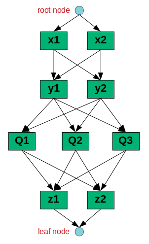
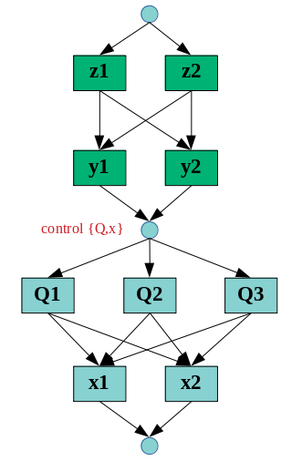

# Adage

## Introduction

Analysis in a Directed Acyclic Graph Environment (ADAGE) is a framework designed to integrate user analysis code as part of a generalized multi-dimensional binning data structure. The data structure is a Directed Acyclic Graph (DAG) that has two types of nodes:
- Bin nodes: hold a one-dimensional bin specification, implemented by the `CutDef` class
- Control nodes: hold lambda expressions, which are executable during DAG traversal algorithms; the term "operator" denotes such lambda expressions

Nodes are implemented by the `Node` class, the DAG is implemented by the `DAG` class. Nodes are connected in `DAG` by single-direction edges, and any path of nodes through the DAG is handled by the `NodePath` class (a linked list). Classes that derive from `DAG` allow for the attachment of any data structure to the multidimensional bin scheme; `HistosDAG` is an example which tracks a `Histos` object (a set of histograms) for each multi-dimensional bin.

The figure below shows a DAG for a 4-dimensional binning scheme in (x,y,Q,z). The small blue circles are control nodes, and the large green rectangles are bin nodes. There is a unique control node at the top, called the root node, and a single control node at the bottom, called a leaf node. Each layer of bin nodes corresponds to one variable, and thus to one dimension. Each layer is fully connected to its neighboring layers; a full connection between two layers is called a "full patch".



There are two DAG traversal algorithms implemented:
- Breadth-first, node repetition disallowed: this scans through the nodes as if you are reading the DAG like text, from top to bottom, left to right; each node is visited exactly once. This traversal is useful for overall operations on the DAG nodes and connections.
- Depth-first, node repetition allowed: starting from the root node, the traversal "descends" as far as it can go, to the leaf node. From there it backtracks and "ascends", searching for a new unique path to the leaf node. Every unique path from the root node to the leaf node will be found.

The last point is critical: every unique path from the root node to the leaf node represents a single multi-dimensional bin, because all the bin layers are included. For example, in the previous figure, the depth first traversal will first descend through `[root,x1,y1,Q1,z1,leaf]`. It then ascends (backtracks) through `z1`, then back to `q1`, then descends down the unexplored path to `z2`, and finally the leaf node. We now have the path `[root,x1,y1,Q1,z2,leaf]`, another multi-dimensional bin. Next the traversal ascends up to `y1`, since we've explored all paths stemming from `Q1`. Then we descend to `Q2`, which will give us the paths `[root,x1,y1,Q2,z1,leaf]` and `[root,x1,y1,Q2,z2,leaf]`. Eventually the traversal will find all the unique root-to-leaf paths, and will ascend back to the root node, where the traversal has nowhere unexplored to go and therefore stops. This traversal thus replicates the following
behavior of nested for loops:

```c
// at root node
for(x in x-bins) {
  for(y in y-bins) {
    for(Q in Q-bins) {
      for(z in z-bins) {
        Payload_Operator(); // lambda staged on the leaf node (see below)
      }
    }
  }
}
// at root node
```

Assuming the pointer to the `HistosDAG` object is `HD`, and `Payload_Operator` is a lambda expression, this pseudocode is implemented in Adage as:

```c
HD->Payload( Payload_Operator );
HD->ExecuteOps();
```

(note: in the syntax (sugar) of post-processor macros, replace `HD` with `P->Op()` and `HD->ExecuteOps()` with `P->Execute()`, where `P` is a `PostProcessor` pointer.)


## Subloops

The leaf node is a control node, which means it can hold a lambda expression. You can connect your custom analysis code via these lambda expressions. Attaching a lambda expression to a control node is called "staging", and a lambda staged on the leaf node is called a `Payload` operator. When the depth-first traversal passes through the leaf node, the payload is executed; since at the leaf node, the full node path includes all dimensions, we are in a unique multi-dimensional bin. Thus staging a payload lambda will cause it to be executed on every multi-dimensional bin during traversal. 

Control nodes are not limited to being root or leaf nodes, in fact they can be inserted between any two layers. The figure below shows an example of a control node inserted between the y and Q layers (note the layers have also been rearranged). The control node is said to "control" the Q layer, and can be called the "Q control node"; it also controls the "subloop" over (Q,x), since the x layer follows the Q layer. 



Two lambda expressions can be staged on each control node:
- Inbound lambda: executes when the DAG depth-first traversal descends through the control node; this will execute before the subloop begins
- Outbound lambda: executes when the DAG depth-first traversal ascends (backtracks) through the control node; this will execute after all bins in the subloop have been traversed through

An inbound lambda staged on the root node is executed before the traversal, while an outbound lambda on the root node is executed after the traversal; these are called `Initial` and `Final` operators. An inbound operator staged on the Q control node will be executed before the (Q,x) subloop, and an outbound operator will be executed after the subloop. There is no difference between inbound and outbound operators staged on the leaf node, since one will be immediately executed after the other. The figure above translates to the following pseudocode:

```c
Initial_Operator();
for(z in z-bins) {
  for(y in y-bins) {
  
    Inbound_Operator_Before_Subloop_Q_x();
    for(Q in Q-bins) {
      for(x in x-bins) {
        Payload_Operator();
      }
    }
    Outbound_Operator_After_Subloop_Q_x();
  
  }
}
Final_Operator();
```

Assuming the names of the Q and x layers are `"q2"` and `"x"`, this pseudocode is implemented in Adage as:

```c
HD->Initial( Initial_Operator );
HD->Final( Final_Operator );
HD->Subloop( {"q2","x"}, Inbound_Operator_Before_Subloop_Q_x, Outbound_Operator_After_Subloop_Q_x );
HD->Payload( Payload_Operator );
HD->ExecuteOps();
```

You can nest subloops however you want. For example, if you want to have a subloop over x bins nested in the (Q,x) subloop, you can call:

```c
HD->Subloop( {"q2","x"}, Inbound_Operator_Before_Subloop_Q_x, Outbound_Operator_After_Subloop_Q_x );
HD->Subloop( {"x"}, Inbound_Operator_Before_Subloop_x, Outbound_Operator_After_Subloop_x );
```

If you try to nest a bigger subloop after a smaller subloop, it may cause unexpected (but predictable) behavior. Defining a second subloop over the same variables will overwrite the first; to run two subloops in a row, with different payloads, you need to use `MultiPayload` (see below).

Technical details: explains how subloops are created on the DAG. Whenever you create a subloop, each layer you have listed as the first argument (above `{"q2","x"}`) will be "re-patched" to the leaf node. First, all the bin-nodes of the Q layer are disconnected from the DAG. The layer above and below this one are then patched to be fully connected (e.g., in the first figure, y and z layers are fully re-patched). The current leaf node is converted into a control node, the Q control node. The Q bins are then connected as outputs of the Q control node, and a new leaf node is created at the bottom of the DAG, with all Q bins as inputs. Next we repeat the procedure for the x-bins. There will now be an x control node, however we only want staged lambdas on the (Q,x) control node (the Q control node), so we do not need the x control node; the x control node is removed and the Q and x layers are fully re-patched together. If you want an x control node, you would define a nested subloop as demonstrated above (argument `{"x"}`).


# Multi-Payloads

It is possible to run a subloop as many times as desired, each with a different payload. In this case,
use a `MultiPayload` to specify each payload operator, as well as the inbound and outbound lambdas for each
new control node; such control nodes are called multi-control nodes. Important: any multi-control node will
overwrite the payload operator with what you specify with `MultiPayload`; therefore you should have no more than
one layer of multi-control nodes, otherwise the payloads will be overwritten. A practical technique is to use
the lambda captures of one payload to capture information from the previous payload, which allows you to "chain"
together subloops. The following figure shows two payloads in the (Q,x) subloop, controlled by two multi-control
nodes. Notice the DAG traversal will go through the left (Q,x) subloop first, then immediately afterward go
through the right (Q,x) subloop.


This figure corresponds to the following pseudocode:

```c
Initial_Operator();
for(z in z-bins) {
  for(y in y-bins) {

    Before_Subloop_1();
    for(Q in Q-bins) {
      for(x in x-bins) {
        Payload_1();
      }
    }
    After_Subloop_1();

    Before_Subloop_2();
    for(Q in Q-bins) {
      for(x in x-bins) {
        Payload_2();
      }
    }
    After_Subloop_2();

  }
}
Final_Operator();
```

Compare to the Adage implementation:

```c
HD->Initial( Initial_Operator );
HD->Final( Final_Operator );
HD->MultiPayload( {"q2","x"}, Payload_1, Before_Subloop_1, After_Subloop_1 );
HD->MultiPayload( {"q2","x"}, Payload_2, Before_Subloop_2, After_Subloop_2 );
HD->ExecuteOps();
```


## Conditional Controls

If you want to control whether or not a subloop executes, use a `ConditionalControl`. Before entering a subloop, the traversal is only aware of what outer-loop bins you are in, so it is useful if your conditional control is a function of those outer bins. To define a conditional control on the (Q,x) subloop, for example, use `ConditionalControl(B)` where `B` is some boolean function of the z and y bins (note: the node path at the (Q,x) control node includes only the z and y bins). This `ConditionalControl` function call must appear in the control node's inbound lambda, and you must also include a call to `EndConditionalControl()` in its outbound lambda.

Implemented in pseudocode with nested for-loops, we have:

```c
Initial_Operator();
for(z in z-bins) {
  for(y in y-bins) {

    Inbound_Operator_Before_Subloop_Q_x();

    if( B(z,y) ) {

      for(Q in Q-bins) {
        for(x in x-bins) {
          Payload_Operator();
        }
      }

    }

    Outbound_Operator_After_Subloop_Q_x();
  }
}
Final_Operator();
```

The code in Adage is:

```c
HD->Initial( Initial_Operator );
HD->Final( Final_Operator );

auto Controlled_Inbound_Operator = [](NodePath *bins){
  Inbound_Operator_Before_Subloop_Q_x();
  bool B = Some_Cut(bins);
  ConditionalControl(B);
};

auto Controlled_Outbound_Operator = [](){
  Outbound_Operator_After_Subloop_Q_x();
  EndConditionalControl();
};

HD->Subloop( {"q2","x"}, Controlled_Inbound_Operator, Controlled_Outbound_Operator );
HD->Payload( Payload_Operator );
HD->ExecuteOps();
```

Technical details: the `ConditionalControl(bool B)` function will remove all outputs of the control node if `B` is false, otherwise it will do nothing if `B` is true. If these outputs are removed, the DAG traversal is forced to backtrack, traversal into the subloop is prevented, and the outbound lambda is immediately executed after the inbound lambda. Calling `EndConditionalControl()` in the outbound lambda will revert any disconnections that occurred in the inbound lambda, restoring the fully-connected structure of the DAG.


## Adage Syntax

See [syntax reference documentation](syntax.md) for a usage guide of the Adage functions, e.g., `Subloop`, `MultiPayload`, etc.

